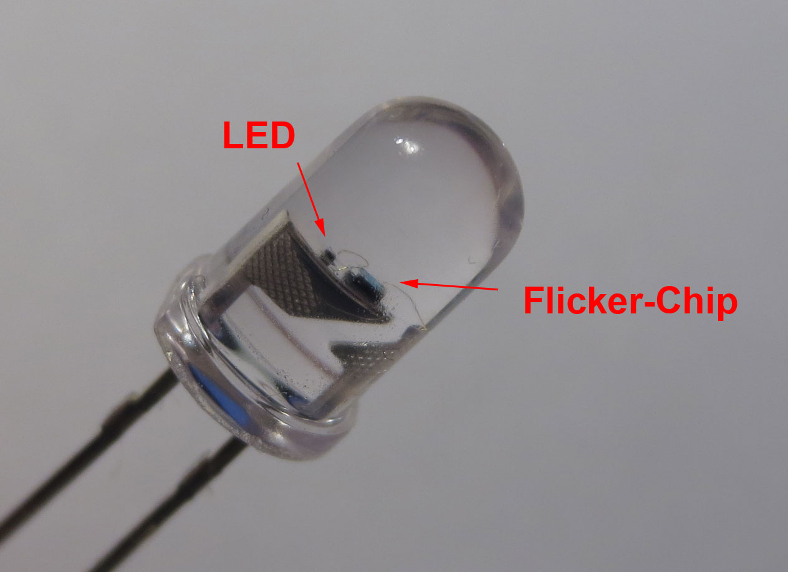

CandleLEDhack
=============

Candle LED reverse engineering and emulation

See [Hacking a candleflicker LED](http://cpldcpu.wordpress.com/2013/12/08/hacking-a-candleflicker-led/)

* Emulator: Emulation of flicker-LED control chip on an AVR microcontroller
* Images: Photos and diagrams
* PatternAnalysis: Source and data of controller chip output analysis

